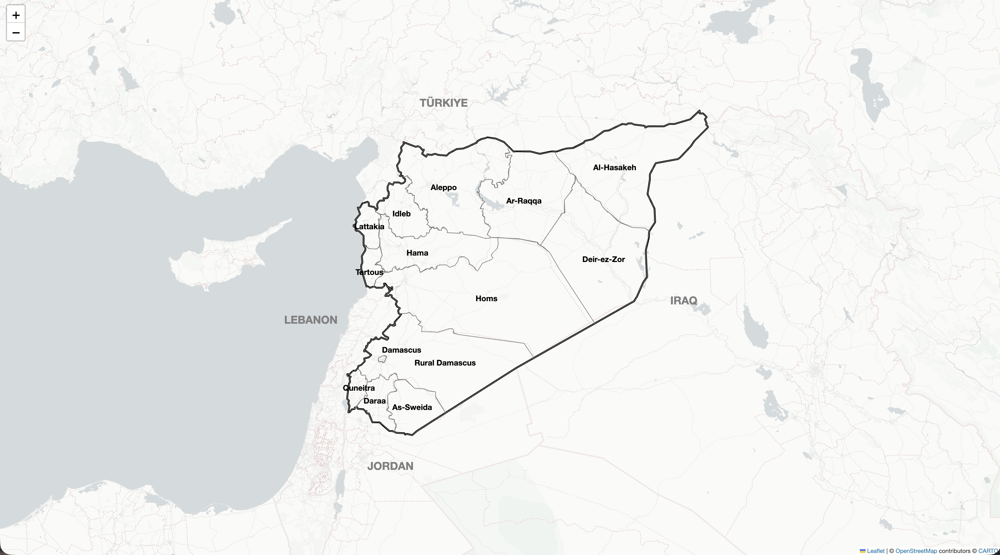
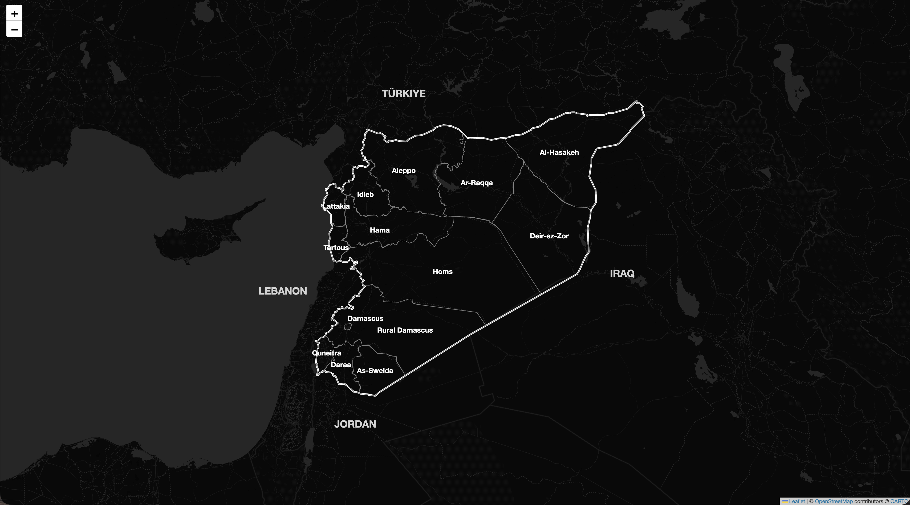
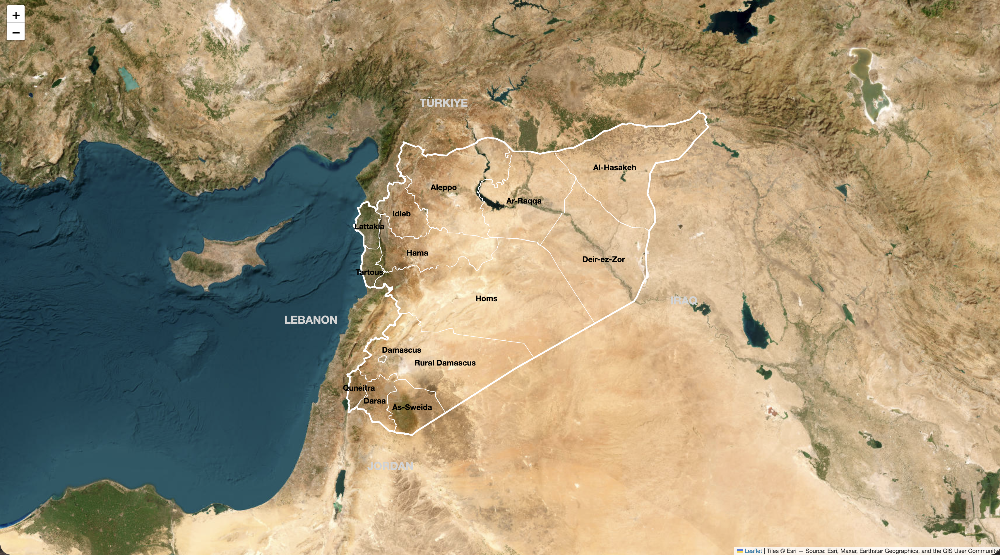
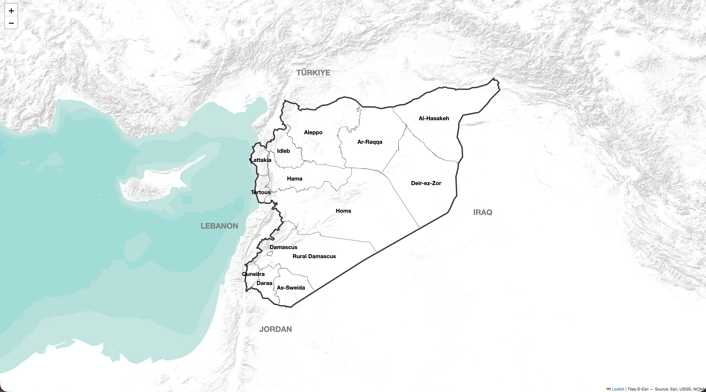

# Syria Basemap Collection

## Overview

This folder contains four interactive basemaps of Syria created with Python and Folium. Each Jupyter Notebook uses the same administrative boundary data and label structure while changing only the background map.

This collection was created as a mapping foundation for visualising vector and raster data in analyses of population, climate hazards, displacement, returns and other topics included in this repository.

## Basemap Collection

- Four basemaps included
- Each map published as an interactive HTML file
- HTML files can be regenerated from each Jupyter Notebook

| No. | Interactive map | Jupyter Notebook | Basemap | Main use |
|---:|---|---|---|---|
| 01 | [View map](PUBLIC_URL) | [Notebook](01_Syria_White_basemap.ipynb) | CARTO Light — No Labels | White background for overlaying thematic layers |
| 02 | [View map](PUBLIC_URL) | [Notebook](02_Syria_Dark_basemap.ipynb) | CARTO Dark — No Labels | Dark background for displaying bright layers |
| 03 | [View map](PUBLIC_URL) | [Notebook](03_Syria_Satellite_basemap.ipynb) | Esri World Imagery | Satellite imagery for examining surface conditions |
| 04 | [View map](PUBLIC_URL) | [Notebook](04_Syria_Physical_basemap.ipynb) | Esri World Terrain | Terrain map for examining topography |

## 01 — White Basemap

This map uses label-free CARTO Light as its background and adds administrative boundaries and names of neighbouring countries through project-level overlays. The white background is suitable for making thematic data visually prominent.

[View interactive map](PUBLIC_URL)

## 02 — Dark Basemap

This map uses label-free CARTO Dark as its background and adds light-coloured administrative boundaries and names of neighbouring countries through project-level overlays. The dark background is suitable for displaying population rasters, proportional symbols and other data that require strong contrast.

[View interactive map](PUBLIC_URL)

## 03 — Satellite Basemap

This map uses Esri World Imagery as its background and adds administrative boundaries and names of neighbouring countries through project-level overlays. The satellite imagery makes it possible to examine land cover and surface conditions in relation to administrative divisions.

[View interactive map](PUBLIC_URL)

## 04 — Physical Basemap

This map uses Esri World Terrain as its background and adds administrative boundaries and names of neighbouring countries through project-level overlays. The terrain map provides a mapping foundation for examining elevation, terrain relief and regional location.

[View interactive map](PUBLIC_URL)

## Shared Specifications

- Syria's national boundary and the boundaries of its 14 governorates
- Governorate names and names of neighbouring countries added through project-level overlays
- Interactive maps created with Folium
- Saved in HTML format and displayed in Jupyter Notebook
- A common map extent and label structure across all Jupyter Notebooks

## Data

Administrative boundary data:

- `syr_admin0.geojson`
- `syr_admin1.geojson`

Source: HDX OCHA, Syria subnational administrative boundaries

## Technologies

- Python
- Folium
- Jupyter Notebook
- HTML / CSS

## How to Run

Run each Jupyter Notebook from top to bottom. The corresponding interactive map will be saved as an HTML file and displayed in Jupyter Notebook.

## Notes

- An internet connection is required to load the background tiles.
- The terms of use and attribution requirements of the respective providers apply to the background maps and administrative boundary data.
- This collection is a mapping foundation for analysis and does not represent the legal status of administrative boundaries.
