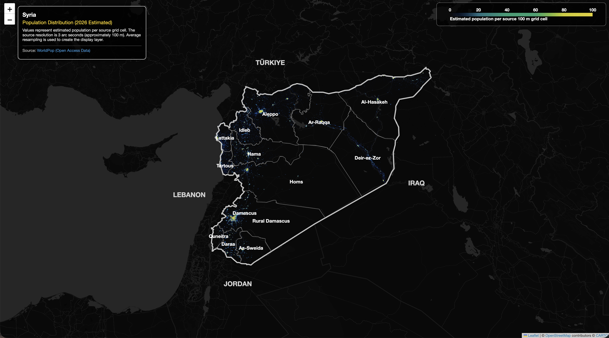
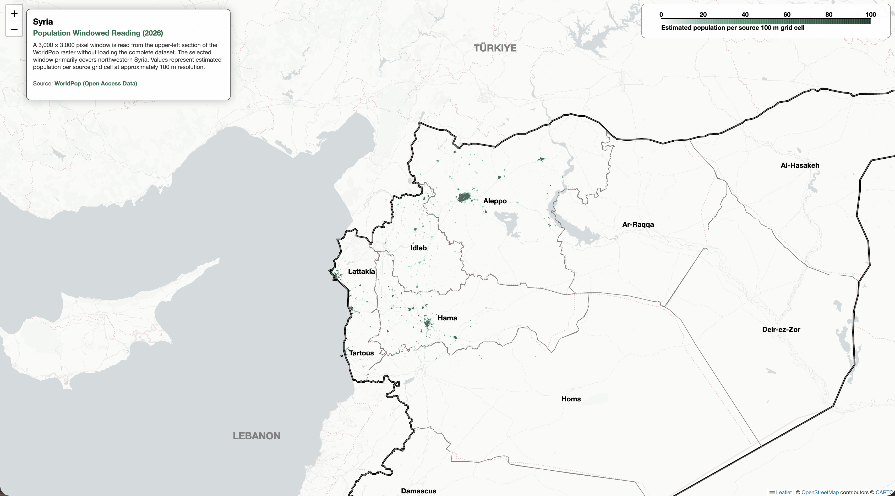
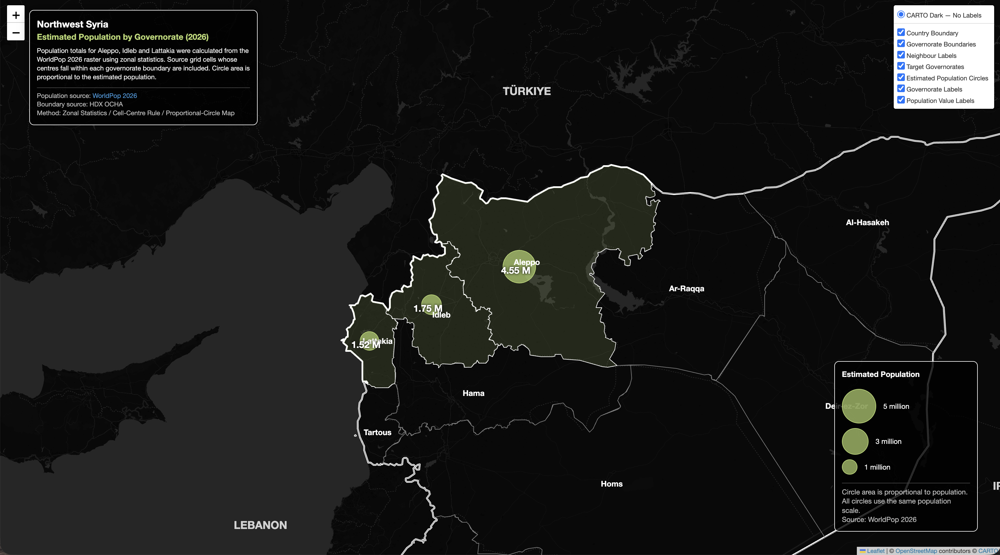
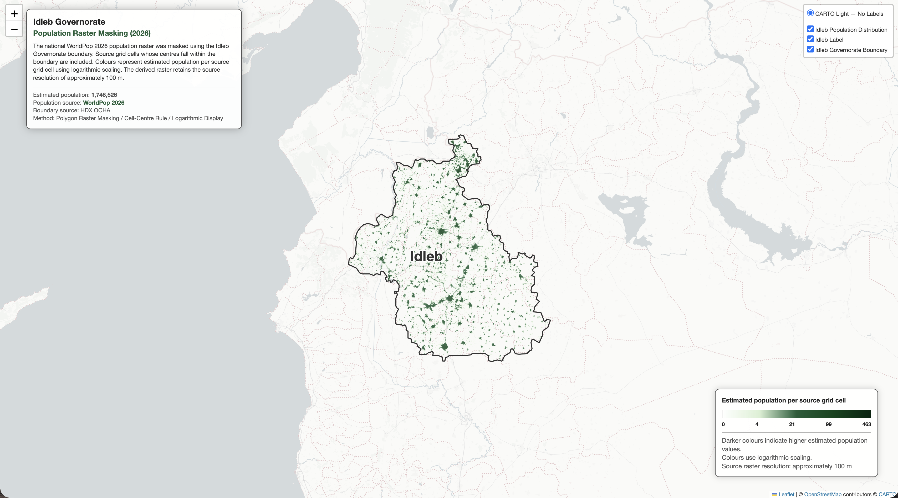

# シリア人口分析コレクション

## 概要

このフォルダには、WorldPop 2026 の人口ラスタを用いて作成した 4 種類のシリア人口分析を収録しています。各 Jupyter Notebook では、全国人口分布の可視化、部分範囲のウィンドウ読み込み、県別人口のゾーン統計、行政界ポリゴンによるラスタマスク処理を行っています。

このコレクションは、人口ラスタの読み込み、加工、集計、抽出、可視化という一連の空間分析手法を、異なる分析目的に応じて実装したものです。

## 分析一覧

- 4 種類の人口分析を収録
- WorldPop 2026 の推計人口ラスタを使用
- 各分析結果をインタラクティブ HTML として出力
- イドリブ県の分析では派生 GeoTIFF も出力

| No. | インタラクティブ地図 | Jupyter Notebook | 分析手法 | 分析対象 |
|---:|---|---|---|---|
| 01 | [地図を表示](https://marisa-saito.github.io/Syria_Humanitarian_Climate_Facts/01_PROJECTS/02_POPULATION_ANALYSIS/01_syria_population_distribution_map.html) | [Notebook](01_Syria_Population_Distribution_Map.ipynb) | ダウンサンプリングとラスタ可視化 | シリア全土 |
| 02 | [地図を表示](https://marisa-saito.github.io/Syria_Humanitarian_Climate_Facts/01_PROJECTS/02_POPULATION_ANALYSIS/02_syria_windowed_reading.html) | [Notebook](02_Syria_WindowedReading.ipynb) | ウィンドウ読み込み | 主にシリア北西部 |
| 03 | [地図を表示](https://marisa-saito.github.io/Syria_Humanitarian_Climate_Facts/01_PROJECTS/02_POPULATION_ANALYSIS/03_syria_zonal_statistics.html) | [Notebook](03_Syria_NW3_ZonalStatistics.ipynb) | ゾーン統計と比例円表示 | Aleppo、Idleb、Lattakia の 3 県 |
| 04 | [地図を表示](https://marisa-saito.github.io/Syria_Humanitarian_Climate_Facts/01_PROJECTS/02_POPULATION_ANALYSIS/04_syria_idleb_mask.html) | [Notebook](04_Syria_Idleb_Mask.ipynb) | ラスタマスク処理 | Idleb 県 |

## 01 — シリア人口分布マップ

WorldPop 2026 の人口ラスタを使用し、シリア全土の推計人口分布を可視化します。Web 地図表示用にラスタを平均値でダウンサンプリングし、独自のカラーマップを適用して、行政界および県名とともに暗色ベースマップ上へ表示します。

主な処理：

- 人口ラスタの読み込みとダウンサンプリング
- NoData 領域の透明化
- 独自のカラーマップの適用
- 行政界、県名、カラー凡例、情報パネルの追加
- インタラクティブ HTML の出力

[インタラクティブ地図を表示](https://marisa-saito.github.io/Syria_Humanitarian_Climate_Facts/01_PROJECTS/02_POPULATION_ANALYSIS/01_syria_population_distribution_map.html)

## 02 — シリア人口ウィンドウ読み込みマップ

WorldPop 2026 の人口ラスタを使用し、元ラスタ全体を読み込まず、左上から 3,000 × 3,000 ピクセルの範囲をウィンドウ読み込みします。選択した範囲は主にシリア北西部を対象としており、元ラスタのグリッドセルごとの推計人口を、行政界およびラベルとともに白色ベースマップ上へ表示します。

主な処理：

- 3,000 × 3,000 ピクセルの読み込み範囲の設定
- 元ラスタ全体を読み込まない部分読み込み
- NoData 領域の透明化
- 集約処理やリサンプリングを行わない人口ラスタの表示
- 行政界、ラベル、カラー凡例、情報パネルの追加
- インタラクティブ HTML の出力

[インタラクティブ地図を表示](https://marisa-saito.github.io/Syria_Humanitarian_Climate_Facts/01_PROJECTS/02_POPULATION_ANALYSIS/02_syria_windowed_reading.html)

## 03 — シリア北西部 3 県人口ゾーン統計マップ

WorldPop 2026 の人口ラスタを使用し、Aleppo、Idleb、Lattakia の 3 県における推計人口をゾーン統計で算出します。各県の行政界内に中心点が含まれる元ラスタセルの人口値を合計し、集計結果を円の面積が人口に比例するシンボルとして暗色ベースマップ上へ表示します。

主な処理：

- 行政界、人口ラスタ、座標参照系、NoData 値の検証
- Aleppo、Idleb、Lattakia の 3 県の選択
- `all_touched=False` による画素中心方式の適用
- ゾーン統計による県別推計人口の算出
- 県ポリゴン内の代表点の作成
- 面積比例円、数値付き凡例、情報パネルの追加
- インタラクティブ HTML の出力

[インタラクティブ地図を表示](https://marisa-saito.github.io/Syria_Humanitarian_Climate_Facts/01_PROJECTS/02_POPULATION_ANALYSIS/03_syria_zonal_statistics.html)

## 04 — Idleb 県人口ラスタマスク処理マップ

WorldPop 2026 の人口ラスタを使用し、シリア全国の人口ラスタを Idleb 県の行政界ポリゴンでマスク処理します。抽出した人口ラスタは、元ラスタの解像度、座標参照系、NoData 定義を保持した派生 GeoTIFF として保存し、対数カラースケールを適用してインタラクティブ地図上へ表示します。

主な処理：

- 行政界、人口ラスタ、座標参照系、NoData 値の検証
- Idleb 県の選択とジオメトリの検証
- 画素中心方式による人口ラスタのマスク処理
- 空間メタデータを保持した派生 GeoTIFF の保存
- 派生 GeoTIFF の検証
- 対数カラースケールの適用
- Idleb 県境、ラベル、凡例、出典情報の追加
- インタラクティブ HTML の出力

派生ラスタ：

- `outputs/worldpop_idleb_2026.tif`

[インタラクティブ地図を表示](https://marisa-saito.github.io/Syria_Humanitarian_Climate_Facts/01_PROJECTS/02_POPULATION_ANALYSIS/04_syria_idleb_mask.html)

## 共通仕様

- WorldPop 2026 の推計人口ラスタを使用
- シリアの行政界データを使用
- NoData 領域を解析および表示時に考慮
- Folium によるインタラクティブ地図
- 凡例および分析情報の表示
- HTML 形式での保存と Jupyter Notebook 上での表示

## データ

人口ラスタデータ：

- `worldpop_syria_2026.tif`

出典：WorldPop, 2026 estimated population dataset

行政界データ：

- `syr_admin0.geojson`
- `syr_admin1.geojson`

出典：HDX OCHA, Syria subnational administrative boundaries

## 使用技術

- Python
- Rasterio
- GeoPandas
- NumPy
- rasterstats
- Folium
- Matplotlib
- Branca
- pathlib

## 実行方法

各 Jupyter Notebook を上から順に実行すると、対応する分析と可視化が行われ、インタラクティブ地図が HTML ファイルとして保存され、Jupyter Notebook 上にも表示されます。

`04_Syria_Idleb_Mask.ipynb` では、インタラクティブ HTML に加えて、マスク処理した人口ラスタが `outputs/worldpop_idleb_2026.tif` として保存されます。

## 注意事項

- 人口値は、国勢調査による実測値ではなく推計値です。
- 元ラスタの解像度は 3 秒角で、約 100 メートルです。
- 01 のダウンサンプリング後の表示レイヤーは、人口総数の計算には使用できません。
- 02 は元ラスタ左上の 3,000 × 3,000 ピクセルのみを表示しており、シリア全土を表すものではありません。
- 03 の解析対象は Aleppo、Idleb、Lattakia の 3 県に限定しています。
- 03 では、中心点が行政界内にあるセルのみを集計し、中心点が行政界外にある境界セルは集計に含めません。
- 03 の円は県ポリゴン内の代表点に配置しており、県都の位置を示すものではありません。
- 03 では、円の半径ではなく円の面積が推計人口に比例します。
- 04 の派生 GeoTIFF は、元ラスタの解像度、座標参照系、NoData 定義を保持します。
- 解析結果は、元ラスタ、行政界、処理範囲、リサンプリング方法、境界セルの処理方法に依存します。
- 背景タイルの利用にはインターネット接続が必要です。
- 背景地図、人口ラスタ、行政界データには、それぞれの提供元の利用条件と帰属表示が適用されます。
- 本コレクションは分析用の地図および推計結果であり、行政界の法的な位置づけを示すものではありません。
