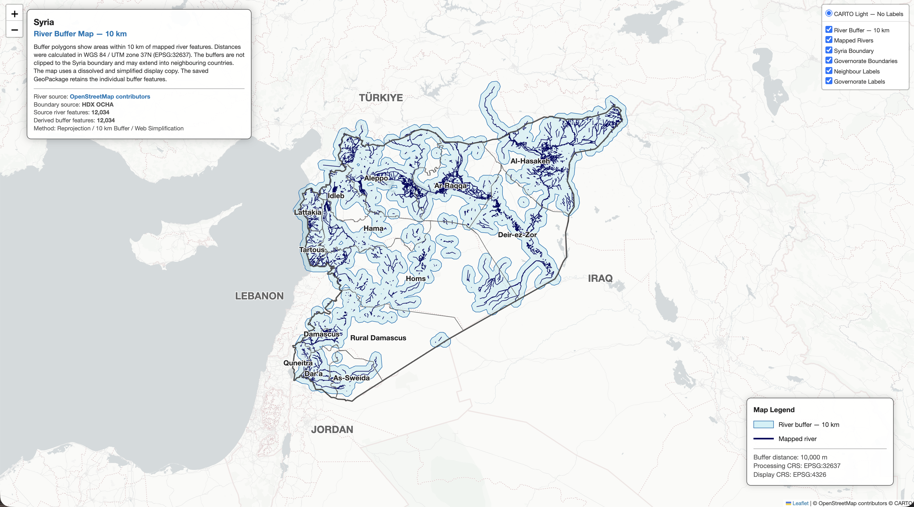
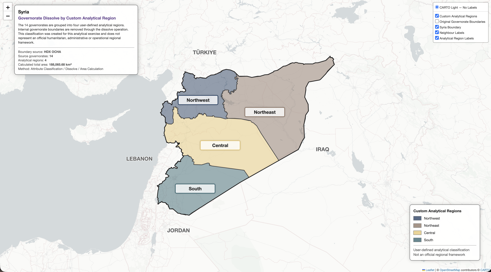
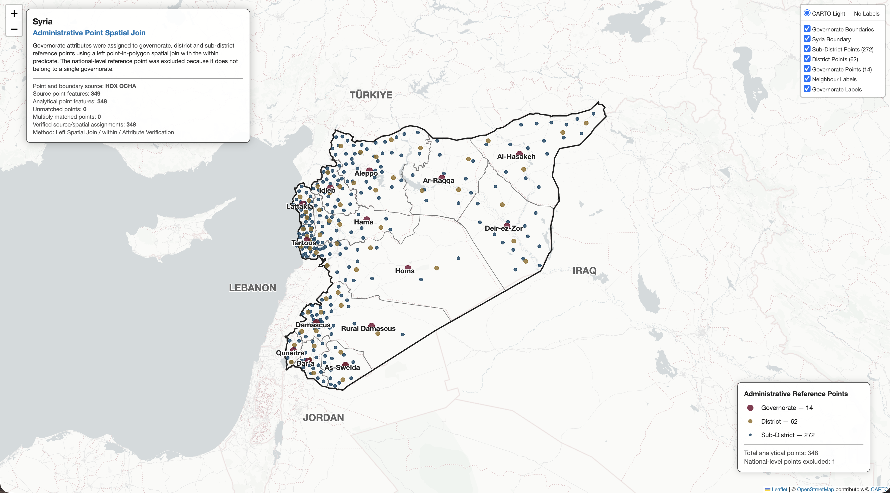
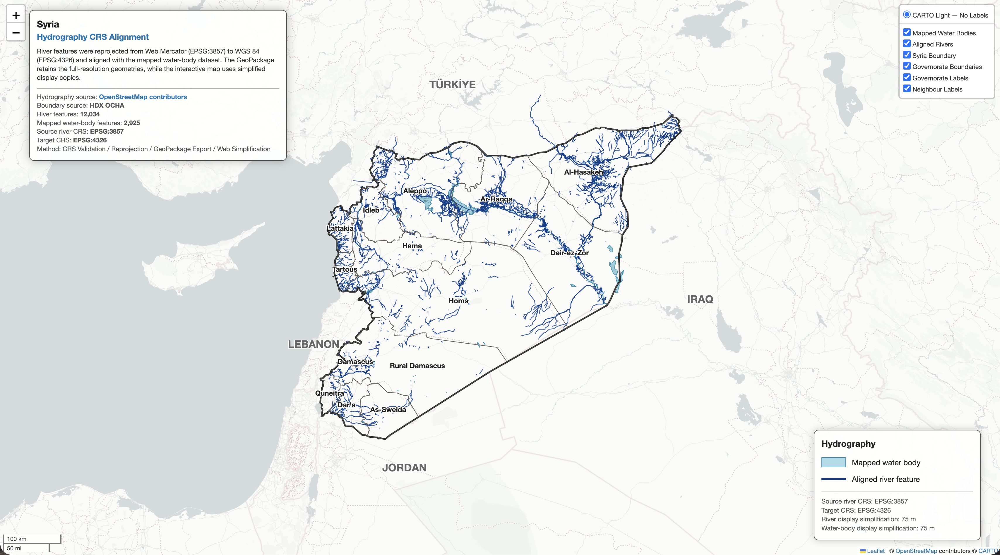

# シリア・ベクター解析コレクション

## 概要

このフォルダには、シリアのベクターデータを用いて作成した 4 種類の空間解析を収録しています。各 Jupyter Notebook では、河川バッファの作成、行政界の Dissolve、行政地点と県境の Spatial Join、水域データの座標参照系の統一を行っています。

このコレクションは、距離解析、境界統合、Point-in-Polygon、属性検証、再投影、データ軽量化という一連のベクター解析手法を、異なる分析目的に応じて実装したものです。

## 分析一覧

- 4 種類のベクター解析を収録
- 各処理で属性、ジオメトリ、座標参照系を検証
- 解析結果を派生 GeoPackage として保存
- 各分析結果をインタラクティブ HTML として出力

| No. | インタラクティブ地図 | Jupyter Notebook | 分析手法 | 分析対象 |
|---:|---|---|---|---|
| 01 | [地図を表示](https://marisa-saito.github.io/Syria_Humanitarian_Climate_Facts/01_PROJECTS/03_VECTOR_OPERATIONS/01_syria_vector_buffer.html) | [Notebook](01_Syria_Vector_Buffer.ipynb) | 再投影と 10 km バッファ | シリアの河川 |
| 02 | [地図を表示](https://marisa-saito.github.io/Syria_Humanitarian_Climate_Facts/01_PROJECTS/03_VECTOR_OPERATIONS/02_syria_vector_dissolve.html) | [Notebook](02_Syria_Vector_Dissolve.ipynb) | 属性集約と Dissolve | 14 県を分類した独自 4 地域 |
| 03 | [地図を表示](https://marisa-saito.github.io/Syria_Humanitarian_Climate_Facts/01_PROJECTS/03_VECTOR_OPERATIONS/03_syria_vector_spatial_join.html) | [Notebook](03_Syria_Vector_SpatialJoin.ipynb) | Point-in-Polygon Spatial Join | 348 行政地点 |
| 04 | [地図を表示](https://marisa-saito.github.io/Syria_Humanitarian_Climate_Facts/01_PROJECTS/03_VECTOR_OPERATIONS/04_syria_vector_crs_alignment.html) | [Notebook](04_Syria_Vector_CRS_Alignment.ipynb) | 再投影と CRS 統一 | 河川および水域 |

## 01 — シリア河川 10 km バッファマップ

シリアのベクターデータを使用し、河川地物の周囲に 10 km のバッファを作成します。距離をメートル単位で計算するため、河川データを Web Mercator から WGS 84 / UTM zone 37N へ再投影し、作成したバッファを元の河川および行政界とともにインタラクティブ地図上へ表示します。

主な処理：

- 河川データと行政界データの検証
- 河川データの WGS 84 / UTM zone 37N への再投影
- 河川地物の周囲への 10 km バッファの作成
- 元の河川属性を保持した派生 GeoPackage の保存
- Web 地図表示用の軽量化コピーの作成
- 河川、バッファ、行政界の表示
- インタラクティブ HTML の出力

派生データ：

- `outputs/syr_river_buffer_10km.gpkg`

[インタラクティブ地図を表示](https://marisa-saito.github.io/Syria_Humanitarian_Climate_Facts/01_PROJECTS/03_VECTOR_OPERATIONS/01_syria_vector_buffer.html)

## 02 — シリア県境独自分析地域 Dissolve マップ

シリアのベクターデータを使用し、14 県を 4 つの独自分析地域へ分類して、各地域内部の県境を Dissolve します。Dissolve 後の地域には、構成する県の名称、Pcode、県数を保持し、投影座標系を用いて各地域の面積を計算します。

主な処理：

- 国境データと県境データの検証
- 14 県の独自 4 地域への分類
- すべての県の分類結果と地域構成の検証
- 県名、Pcode、県数の集約
- 分析地域ごとの県境の Dissolve
- WGS 84 / UTM zone 37N を用いた地域面積の計算
- 派生 GeoPackage の保存と検証
- インタラクティブ HTML の出力

派生データ：

- `syr_custom_analytical_regions.gpkg`

[インタラクティブ地図を表示](https://marisa-saito.github.io/Syria_Humanitarian_Climate_Facts/01_PROJECTS/03_VECTOR_OPERATIONS/02_syria_vector_dissolve.html)

## 03 — シリア行政地点 Spatial Join マップ

シリアのベクターデータを使用し、Point-in-Polygon Spatial Join によって行政地点へ所属県の属性を付与します。国レベルの代表地点を除外した 348 地点を対象に、`within` を空間述語とする左結合を実行し、未結合地点、複数の県に結合された地点、元データの県属性との一致を検証します。

主な処理：

- 行政地点データと行政界データの検証
- 国レベルの代表地点の除外
- `within` を空間述語とする左 Spatial Join
- 未結合地点および複数の県に結合された地点の検出
- Spatial Join で取得した県属性と元の県属性の照合
- 検証済み結果の派生 GeoPackage への保存
- 行政レベル別の地点レイヤーの作成
- 行政界、ラベル、凡例、情報パネル、レイヤー切り替え機能の追加
- インタラクティブ HTML の出力

[インタラクティブ地図を表示](https://marisa-saito.github.io/Syria_Humanitarian_Climate_Facts/01_PROJECTS/03_VECTOR_OPERATIONS/03_syria_vector_spatial_join.html)

## 04 — シリア水域データ CRS 統一マップ

シリアのベクターデータを使用し、異なる座標参照系を持つ河川データと水域データを同じ座標参照系へ統一します。河川データを Web Mercator（EPSG:3857）から WGS 84（EPSG:4326）へ再投影し、全解像度データを GeoPackage へ保存して、軽量化したコピーをインタラクティブ地図上へ表示します。

主な処理：

- 河川、水域、行政界データの検証
- 各入力データの座標参照系の確認
- 河川データの EPSG:3857 から EPSG:4326 への再投影
- 再投影後の地物数とジオメトリ形式の検証
- CRS を統一した全解像度データの GeoPackage への保存
- 保存した GeoPackage レイヤーの再読み込みと検証
- Web 地図表示用の軽量化コピーの作成
- 水域、行政界、ラベル、凡例、情報パネル、レイヤー切り替え機能の追加
- インタラクティブ HTML の出力

[インタラクティブ地図を表示](https://marisa-saito.github.io/Syria_Humanitarian_Climate_Facts/01_PROJECTS/03_VECTOR_OPERATIONS/04_syria_vector_crs_alignment.html)

## 共通仕様

- ベクターデータの属性、ジオメトリ、座標参照系を検証
- GeoPandas によるベクター解析
- 解析結果を派生 GeoPackage として保存
- Folium によるインタラクティブ地図
- 行政界、ラベル、凡例、分析情報の表示
- HTML 形式での保存と Jupyter Notebook 上での表示

## データ

河川データ：

- `syr_rivers_3857.geojson`
- `syr_lakes_4326.geojson`

出典：OpenStreetMap contributors

行政地点データ：

- `syr_adminpoints.geojson`

行政界データ：

- `syr_admin0.geojson`
- `syr_admin1.geojson`

出典：HDX OCHA, Syria subnational administrative boundaries

## 使用技術

- Python
- GeoPandas
- Folium
- Shapely
- PyProj
- GeoPackage

## 実行方法

各 Jupyter Notebook を上から順に実行すると、対応するベクター解析と可視化が行われ、派生データとインタラクティブ HTML が保存され、Jupyter Notebook 上にも地図が表示されます。

`01_Syria_Vector_Buffer.ipynb` では、10 km 河川バッファが `outputs/syr_river_buffer_10km.gpkg` として保存されます。

`02_Syria_Vector_Dissolve.ipynb` では、Dissolve 後の独自分析地域が `syr_custom_analytical_regions.gpkg` として保存されます。

## 注意事項

- 01 では、距離をメートル単位で計算するため、河川データを WGS 84 / UTM zone 37N へ再投影しています。
- 01 のバッファはシリア国境で切り抜いていないため、隣国側へ広がる場合があります。
- 02 の 4 地域は本分析のために独自に設定したものであり、公式な人道支援区分、行政区分、活動地域区分を示すものではありません。
- 02 の Dissolve 後の地域には、構成する県の名称、Pcode、県数を保持しています。
- 03 では、単一の県に所属しない国レベルの代表地点を分析対象から除外しています。
- 03 では、`within` を空間述語とする左結合により、すべての分析対象地点を保持しています。
- 04 の全解像度データは GeoPackage に保存し、インタラクティブ地図には軽量化したコピーを使用しています。
- Web 地図表示用の軽量化コピーは可視化に使用し、全解像度の派生データとは区別して扱います。
- 背景タイルの利用にはインターネット接続が必要です。
- 背景地図、行政界、河川データには、それぞれの提供元の利用条件と帰属表示が適用されます。
- 本コレクションは分析用の地図および独自分類を含み、行政界や地域区分の法的または公式な位置づけを示すものではありません。
