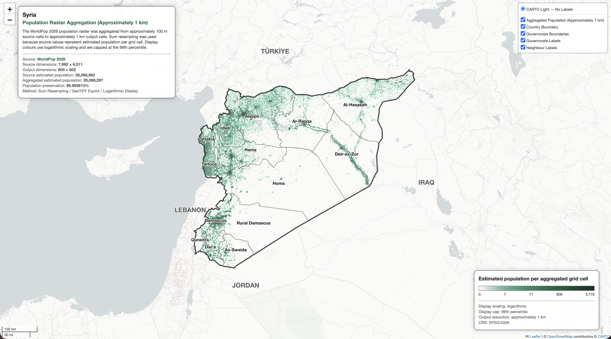
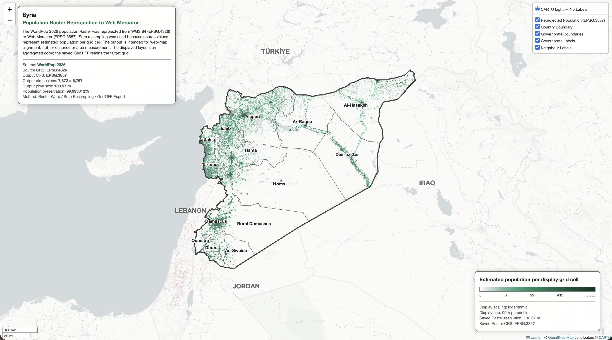

# シリア・ラスタ解析コレクション

## 概要

このフォルダには、WorldPop 2026 の人口ラスタを用いて作成した 2 種類のラスタ解析を収録しています。各 Jupyter Notebook では、約 100 m から約 1 km への人口ラスタの集約と、WGS 84 から Web Mercator への人口ラスタの再投影を行っています。

このコレクションは、人口値を保持する合計リサンプリング、出力グリッドの計算、メタデータの更新、処理前後の人口合計の検証という一連のラスタ解析手法を、異なる処理目的に応じて実装したものです。

## 分析一覧

- 2 種類のラスタ解析を収録
- WorldPop 2026 の推計人口ラスタを使用
- 合計リサンプリングにより推計人口合計を保持
- 解析結果を派生 GeoTIFF として保存
- 各分析結果をインタラクティブ HTML として出力

| No. | インタラクティブ地図 | Jupyter Notebook | 分析手法 | 処理内容 |
|---:|---|---|---|---|
| 01 | [地図を表示](https://marisa-saito.github.io/Syria_Humanitarian_Climate_Facts/01_PROJECTS/04_RASTER_OPERATIONS/01_syria_raster_resample.html) | [Notebook](01_Syria_Raster_Resample.ipynb) | 合計リサンプリングによる集約 | 約 100 m から約 1 km |
| 02 | [地図を表示](https://marisa-saito.github.io/Syria_Humanitarian_Climate_Facts/01_PROJECTS/04_RASTER_OPERATIONS/02_syria_raster_reprojection.html) | [Notebook](02_Syria_Raster_Reprojection.ipynb) | 合計リサンプリングによる再投影 | EPSG:4326 から EPSG:3857 |

## 01 — シリア人口ラスタ約 1 km 集約マップ

WorldPop 2026 の人口ラスタを使用し、約 100 m の元解像度から約 1 km の出力解像度へ集約します。出力セルに対応する元セルの推計人口を合計するため、合計リサンプリングを使用し、処理前後の人口合計を比較して結果を検証します。

主な処理：

- 元ラスタの CRS、サイズ、Transform、NoData 値、データ型の検証
- 元ラスタの幅と高さを 10 分の 1 とする出力サイズの設定
- 出力グリッドと Transform の計算
- 合計リサンプリングによる人口ラスタの集約
- 集約前後の有効セル数と人口合計の比較
- 集約結果の派生 GeoTIFF への保存
- 保存した GeoTIFF の再読み込みと検証
- 行政界、凡例、情報パネルの追加
- インタラクティブ HTML の出力

[インタラクティブ地図を表示](https://marisa-saito.github.io/Syria_Humanitarian_Climate_Facts/01_PROJECTS/04_RASTER_OPERATIONS/01_syria_raster_resample.html)

## 02 — シリア人口ラスタ Web Mercator 再投影マップ

WorldPop 2026 の人口ラスタを使用し、WGS 84（EPSG:4326）から Web Mercator（EPSG:3857）へ再投影します。対応する元セルの推計人口を保持するため、合計リサンプリングを使用し、処理前後の人口合計を比較して結果を検証します。

主な処理：

- 元ラスタの CRS、サイズ、Transform、範囲、NoData 値の検証
- EPSG:3857 の出力グリッドの計算
- 合計リサンプリングによる人口ラスタの再投影
- 再投影前後の人口合計の比較
- 再投影結果の派生 GeoTIFF への保存
- 保存した GeoTIFF の再読み込みと検証
- Folium 表示用の出力範囲の変換
- 行政界、凡例、情報パネルの追加
- インタラクティブ HTML の出力

[インタラクティブ地図を表示](https://marisa-saito.github.io/Syria_Humanitarian_Climate_Facts/01_PROJECTS/04_RASTER_OPERATIONS/02_syria_raster_reprojection.html)

## 共通仕様

- WorldPop 2026 の推計人口ラスタを使用
- 元ラスタのメタデータと値を検証
- NoData 領域を解析および表示時に考慮
- 合計リサンプリングにより推計人口合計を保持
- 処理前後の人口合計を比較
- 解析結果を派生 GeoTIFF として保存し、再読み込み後に検証
- Folium によるインタラクティブ地図
- HTML 形式での保存と Jupyter Notebook 上での表示

## データ

人口ラスタデータ：

- `worldpop_syria_2026.tif`

出典：WorldPop, open population data

行政界データ：

- `syr_admin0.geojson`
- `syr_admin1.geojson`

出典：HDX OCHA, Syria subnational administrative boundaries

## 使用技術

- Python
- Rasterio
- NumPy
- GeoPandas
- Folium
- Matplotlib
- GeoTIFF

## 実行方法

各 Jupyter Notebook を上から順に実行すると、対応するラスタ解析と可視化が行われ、派生 GeoTIFF とインタラクティブ HTML が保存され、Jupyter Notebook 上にも地図が表示されます。

01 では約 1 km へ集約した人口ラスタ、02 では Web Mercator へ再投影した人口ラスタが、それぞれ派生 GeoTIFF として保存されます。

## 注意事項

- 人口値は、国勢調査による実測値ではなく、元グリッドセルごとの推計値です。
- 01 では、元ラスタの幅と高さを 10 分の 1 にして、約 100 m から約 1 km へ集約しています。
- 01 では、各出力セルに対応する元セルの人口値を合計しています。
- 02 の出力は、Web Mercator を使用する Web 地図タイルとの座標系統一を目的としています。
- 02 では、EPSG:3857 を距離や面積の計測には使用していません。
- 両分析では、合計リサンプリングを使用し、処理前後の人口合計を比較しています。
- 解析結果は、元ラスタ、出力グリッド、リサンプリング方法、NoData の処理方法に依存します。
- 背景タイルの利用にはインターネット接続が必要です。
- 背景地図、人口ラスタ、行政界データには、それぞれの提供元の利用条件と帰属表示が適用されます。
- 本コレクションは分析用の地図および推計結果であり、行政界の法的な位置づけを示すものではありません。
