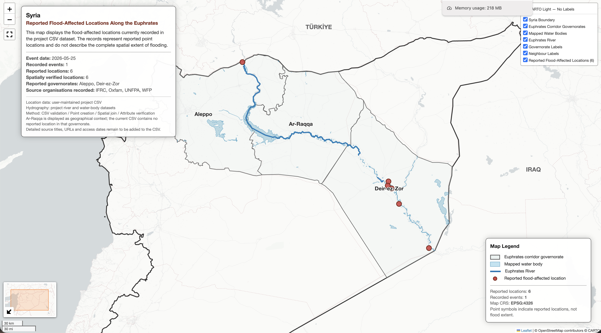

# シリア気候災害マッピング

## 概要

このフォルダには、シリアのユーフラテス川流域における洪水被害報告地点を可視化したインタラクティブ地図を収録しています。更新可能なプロジェクト CSV を読み込み、各レコードを検証して空間ポイントデータへ変換し、行政界との Spatial Join によって報告県を確認しています。

現在のデータには、2026 年 5 月 25 日の 1 件の洪水事象に関連する 6 地点が収録されています。報告地点は Aleppo 県および Deir-ez-Zor 県に位置し、Ar-Raqqa 県はユーフラテス川流域の地理的背景として表示しています。

## 作品一覧

- 更新可能な CSV を使用した洪水被害報告地点マップ
- CSV の構造、識別子、日付、座標、重複を検証
- Spatial Join により CSV 記載県と空間判定県を照合
- 検証済み地点を派生 GeoPackage として保存
- 分析結果をインタラクティブ HTML として出力

| No. | インタラクティブ地図 | Jupyter Notebook | 分析手法 | 分析対象 |
|---:|---|---|---|---|
| 01 | [地図を表示](https://marisa-saito.github.io/Syria_Humanitarian_Climate_Facts/01_PROJECTS/05_CLIMATE_HAZARD_MAPPING/01_syria_euphrates_flood_affected_locations.html) | [Notebook](01_Syria_EuphratesFloodEvents_Map.ipynb) | CSV 検証と Point-in-Polygon Spatial Join | ユーフラテス川流域の報告地点（現在 6 地点） |

## 01 — ユーフラテス川流域洪水被害報告地点マップ

更新可能なプロジェクト CSV を使用し、ユーフラテス川流域の洪水被害報告地点を可視化します。緯度・経度から空間ポイントデータを作成し、`within` を空間述語とする Spatial Join によって各地点の所属県を判定して、CSV に記録された県名との一致を検証します。

主な処理：

- CSV の列構成と必須項目の検証
- 地点 ID・事象 ID の形式と一意性の検証
- 日付、緯度・経度、重複地点の検証
- 緯度・経度から EPSG:4326 のポイントデータを作成
- 行政界、河川、水域データの属性・CRS・ジオメトリの検証
- 河川データからユーフラテス川を抽出
- Aleppo、Ar-Raqqa、Deir-ez-Zor の 3 県を流域背景として抽出
- `within` を空間述語とする左 Spatial Join
- 未結合地点、複数の県に結合された地点、県名不一致の検出
- 検証済み地点の派生 GeoPackage への保存と再検証
- ユーフラテス川、水域、行政界、報告地点の表示
- 凡例、情報パネル、ポップアップ、レイヤー切り替え機能の追加
- インタラクティブ HTML の出力

派生データ：

- `outputs/euphrates_flood_affected_locations_validated.gpkg`

[インタラクティブ地図を表示](https://marisa-saito.github.io/Syria_Humanitarian_Climate_Facts/01_PROJECTS/05_CLIMATE_HAZARD_MAPPING/01_syria_euphrates_flood_affected_locations.html)

## 実装仕様

- 更新可能な CSV を入力データとして使用
- 必須列と想定外の列を検証
- 正規表現によって地点 ID と事象 ID の形式を検証
- 地点 ID と事象・地点レコードの重複を検証
- 報告座標を GeoDataFrame へ変換
- 空間データを WGS 84（EPSG:4326）へ統一
- Spatial Join の結果を CSV 記載県と照合
- 検証済み属性とジオメトリを GeoPackage に保存
- 保存した GeoPackage の地物数、CRS、地点 ID の一意性を再検証
- Folium によるインタラクティブ地図

## データ

洪水被害報告地点データ：

- `climap_euphrates_flood_affected_locations.csv`

出典：ユーザー管理のプロジェクトデータ

行政界データ：

- `syr_admin1.geojson`

出典：HDX OCHA, Syria subnational administrative boundaries

河川・水域データ：

- `syr_rivers_3857.geojson`
- `syr_lakes_4326.geojson`

出典：OpenStreetMap contributors

## 使用技術

- Python
- Pandas
- GeoPandas
- Folium
- Shapely
- Branca
- GeoPackage

## 実行方法

`01_Syria_EuphratesFloodEvents_Map.ipynb` を上から順に実行すると、CSV と空間データの検証、地点データの作成、Spatial Join、県名照合、可視化が行われます。

検証済み地点は `outputs/euphrates_flood_affected_locations_validated.gpkg` として保存され、インタラクティブ地図は `01_syria_euphrates_flood_affected_locations.html` として保存され、Jupyter Notebook 上にも表示されます。

## 注意事項

- 現在の CSV には、2026 年 5 月 25 日の 1 件の洪水事象に関連する 6 地点が収録されています。
- 現在の報告地点は Aleppo 県および Deir-ez-Zor 県に位置します。
- Ar-Raqqa 県は地理的背景として表示していますが、現在の CSV には同県内の報告地点は収録されていません。
- このデータは報告地点を示すものであり、洪水の面的な広がりを示すものではありません。
- 情報提供組織は記録されていますが、資料名、URL、閲覧日は今後追加する必要があります。
- この地図は Notebook 実行時点の CSV を反映するため、地点や出典情報の追加に伴って更新されます。
- この地図は、シリア国内のすべての洪水被害地点を網羅するものではありません。
- 背景タイルの利用にはインターネット接続が必要です。
- 背景地図、行政界、河川・水域データには、それぞれの提供元の利用条件と帰属表示が適用されます。
- 本作品は報告地点を可視化した分析用地図であり、行政界の法的な位置づけを示すものではありません。
