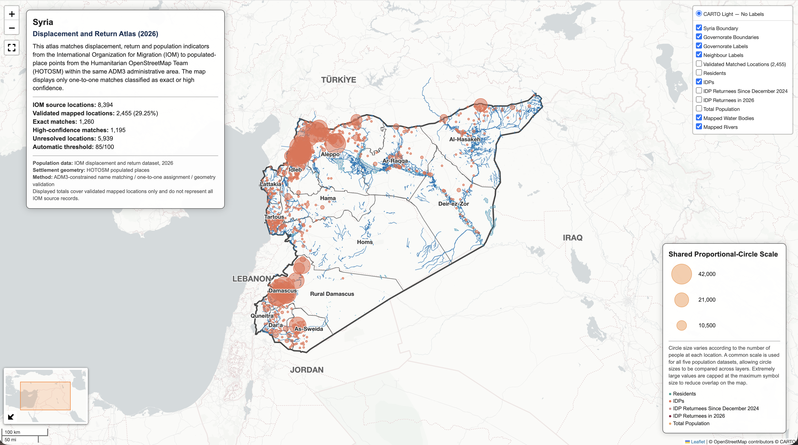
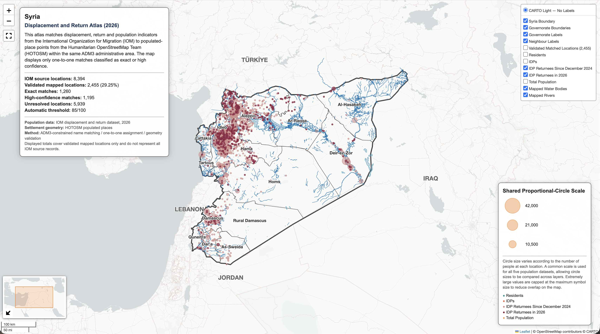

# Syria Humanitarian Climate Facts

[日本語](README_JP.md)

<p align="center">
  
  
</p>

**[View Live Map](https://marisa-saito.github.io/Syria_Humanitarian_Climate_Facts/01_PROJECTS/06_DISPLACEMENT_RETURN_ATLAS/01_syria_displacement_and_return_atlas.html)** | **[View Notebook](01_PROJECTS/06_DISPLACEMENT_RETURN_ATLAS/01_Syria_Displacement_and_Return_Atlas.ipynb)**

Matched 8,394 IOM displacement and return records (no coordinates) against HOTOSM settlement points using fuzzy name matching within ADM3 boundaries, validating 2,455 locations (1,260 exact, 1,195 high-confidence matches). Built a reproducible, auditable pipeline covering input validation, CRS/geometry checks, and quality-controlled outputs. Applied to grant proposals and organisational reporting for a Syria-based humanitarian NPO.

## Overview

This repository contains a Python and GIS portfolio focused on humanitarian assistance, population, climate hazards, displacement and return in Syria. Across six collections and 17 Jupyter Notebooks, it implements basemap design, population-raster analysis, vector operations, raster processing, validation of updatable hazard data, and location matching across heterogeneous datasets.

Each project goes beyond map visualisation by validating input structure, attributes, coordinate reference systems, geometries, missing values, duplicates and aggregated results. Outputs are saved in formats suited to their purpose, including interactive HTML, images, GeoTIFF, GeoPackage and audit CSV.

## Collections

- Six GIS collections
- 17 Jupyter Notebooks with corresponding interactive HTML outputs
- Spatial processing of both vector and raster data
- Emphasis on input validation, post-processing verification and audit outputs
- Japanese and English README files in each collection

| No. | Collection | Projects | Primary methods | Scope |
|---:|---|---:|---|---|
| 01 | [Basemap Collection](01_PROJECTS/01_BASEMAP_COLLECTION/README.md) | 4 | Basemap, administrative-boundary and label design | All of Syria |
| 02 | [Population Analysis](01_PROJECTS/02_POPULATION_ANALYSIS/README.md) | 4 | Downsampling, windowed reading, zonal statistics and raster masking | All of Syria and the north-west |
| 03 | [Vector Operations](01_PROJECTS/03_VECTOR_OPERATIONS/README.md) | 4 | Buffer, Dissolve, Spatial Join and CRS alignment | Rivers, water bodies, administrative boundaries and administrative points |
| 04 | [Raster Operations](01_PROJECTS/04_RASTER_OPERATIONS/README.md) | 2 | Sum resampling, aggregation and reprojection | WorldPop 2026 population raster |
| 05 | [Climate Hazard Mapping](01_PROJECTS/05_CLIMATE_HAZARD_MAPPING/README.md) | 1 | CSV validation and Point-in-Polygon Spatial Join | Reported flood-affected locations in the Euphrates basin |
| 06 | [Displacement and Return Atlas](01_PROJECTS/06_DISPLACEMENT_RETURN_ATLAS/README.md) | 2 | Pcode, name normalisation, string similarity and one-to-one matching | IOM displacement and return locations |

## Portfolio Structure

### 01–04 — Technical GIS foundations

- Basemap design for thematic overlays
- Windowed reading, aggregation, extraction and visualisation of population rasters
- Distance analysis, boundary aggregation, Point-in-Polygon and reprojection
- Sum resampling to preserve population totals
- Separation of full-resolution analytical data from lightweight web-display data

### 05 — Updatable climate-hazard data

- Validation of the structure and values of an updatable project CSV
- Creation of spatial point data from latitude and longitude
- Comparison of reported governorates with spatially determined governorates
- Storage of validated locations in a derived GeoPackage

### 06 — Heterogeneous data integration and auditing

- Integration of IOM population indicators with HOTOSM point geometries
- Restriction of matching candidates by ADM3 Pcode
- Evaluation of candidates through normalised names and string similarity
- Automatic acceptance of exact matches or similarities of at least 85%
- Storage of accepted, review, duplicate-conflict and no-candidate decisions in an audit CSV

## Common Workflow

- Validate input files, required fields, data types, missing values and duplicates
- Inspect CRS, geometry, NoData values and spatial extent
- Select projected coordinate systems and spatial operations for the analytical purpose
- Compare feature counts, population totals, attributes and identifiers before and after processing
- Save derived data and verify it after reloading
- Distinguish analytical data from lightweight web-display data
- Document analytical limitations and scope in the README files and maps

## Technologies

- Python
- Jupyter Notebook
- Pandas
- GeoPandas
- Rasterio
- NumPy
- rasterstats
- Shapely
- PyProj
- difflib
- Folium
- Matplotlib
- Branca
- GeoTIFF
- GeoPackage
- HTML / CSS

## Repository Structure

```text
Syria_Humanitarian_Climate_Facts/
├── 01_PROJECTS/
│   ├── 01_BASEMAP_COLLECTION/
│   ├── 02_POPULATION_ANALYSIS/
│   ├── 03_VECTOR_OPERATIONS/
│   ├── 04_RASTER_OPERATIONS/
│   ├── 05_CLIMATE_HAZARD_MAPPING/
│   └── 06_DISPLACEMENT_RETURN_ATLAS/
├── 03_DOCUMENTS/
│   ├── DATA_CATALOG.md
│   └── DATA_CATALOG_JP.md
├── README.md
└── README_JP.md
```

Each collection contains Japanese and English README files describing the analysis, technologies, execution method, data and limitations.

## Data

Primary data providers:

- HDX OCHA — Syrian administrative boundaries
- WorldPop — 2026 estimated population raster
- OpenStreetMap contributors — river and water-body data
- Humanitarian OpenStreetMap Team (HOTOSM) — populated-place points
- International Organization for Migration (IOM) — displacement and return baseline data
- Project-maintained CSV — reported flood-affected locations

The source datasets are not included in this public repository because of file-size considerations and the terms of use applied by their providers. The datasets and sources are listed in the [Data Catalogue](03_DOCUMENTS/DATA_CATALOG.md).

## Execution

Review the README and introductory text in each collection's Jupyter Notebooks, then prepare the required input data and Python libraries. Running each Notebook from top to bottom performs the corresponding spatial processing, saves derived data and generates interactive HTML.

Saved execution outputs have been removed from the published Notebooks to keep the code and workflow easy to review on GitHub. Completed maps remain available through the HTML files and images included in each collection.

## Notes

- Population values are estimates based on the source dataset rather than observed census counts.
- Reported flood-affected locations do not represent the spatial extent of flooding or all affected locations in Syria.
- The locations displayed in the displacement and return atlas are limited to records that meet the defined matching criteria and do not represent the complete IOM source dataset.
- Analytical results depend on the source data, processing extent, coordinate reference systems, boundary-cell treatment and matching criteria.
- Basemaps and datasets remain subject to the terms of use and attribution requirements of their respective providers.
- This portfolio contains analytical maps and derived data and does not represent the legal or official status of administrative boundaries.

## Contact

Marisa Saito
Email: marisa.saito.ms@outlook.com
LinkedIn: https://www.linkedin.com/in/marisasaito/
