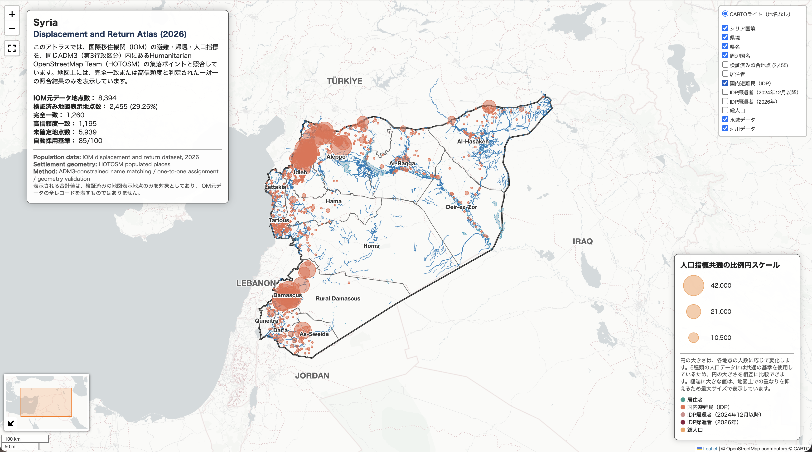
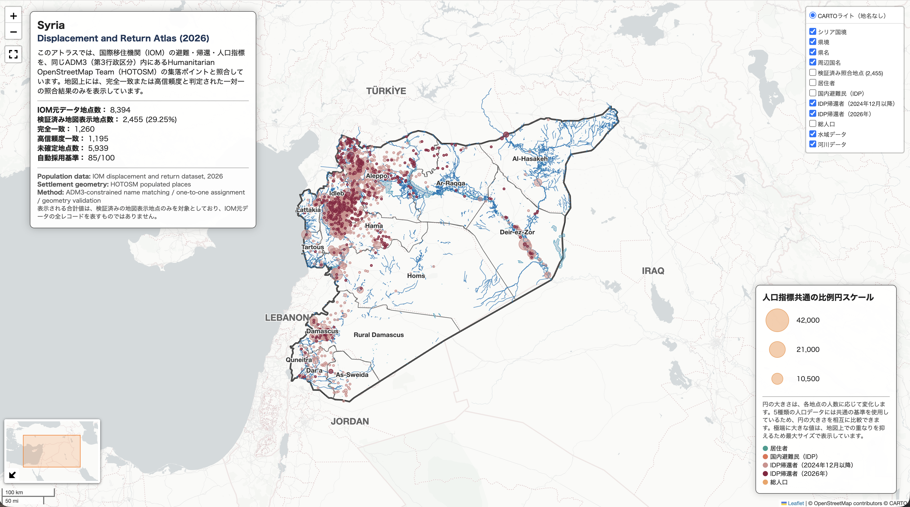

# Syria Humanitarian Climate Facts

[English](README.md)

<p align="center">
  
  
</p>

**[地図を見る](https://marisa-saito.github.io/Syria_Humanitarian_Climate_Facts/01_PROJECTS/06_DISPLACEMENT_RETURN_ATLAS/02_syria_displacement_and_return_atlas_jp.html)** | **[Notebookを見る](01_PROJECTS/06_DISPLACEMENT_RETURN_ATLAS/02_Syria_Displacement_and_Return_Atlas_JP.ipynb)**

座標を持たないIOMの避難・帰還データ8,394件を、ADM3行政区域内でHOTOSMの集落データとファジーマッチングにより照合し、2,455地点(完全一致1,260件、高信頼一致1,195件)を検証・地図化。入力検証、CRS/ジオメトリチェック、品質管理された出力までを含む、再現可能で監査可能なパイプラインを構築。シリアの人道支援NPOでの助成金申請・団体報告に活用。

## 概要

このリポジトリには、シリアの人道支援、人口、気候災害、避難・帰還を対象とした Python・GIS ポートフォリオを収録しています。6 つのコレクションと 17 の Jupyter Notebook を通して、ベースマップ設計、人口ラスタ分析、ベクター解析、ラスタ処理、更新可能な災害データの検証、異種データの地点照合を実装しています。

各作品では、地図の可視化だけでなく、入力データの構造、属性、座標参照系、ジオメトリ、欠損値、重複、集計結果を検証しています。分析結果は、インタラクティブ HTML、画像、GeoTIFF、GeoPackage、監査 CSV など、目的に応じた形式で保存しています。

## 収録コレクション

- 6 つの GIS コレクションを収録
- 17 の Jupyter Notebook と対応するインタラクティブ HTML を収録
- ベクター・ラスタ双方の空間処理を実装
- 入力検証、処理後の再検証、監査用データの保存を重視
- 日本語版と英語版の README を各コレクションに収録

| No. | コレクション | 作品数 | 主な分析手法 | 分析対象 |
|---:|---|---:|---|---|
| 01 | [ベースマップ・コレクション](01_PROJECTS/01_BASEMAP_COLLECTION/README_JP.md) | 4 | 背景地図、行政界、ラベル設計 | シリア全土 |
| 02 | [人口分析](01_PROJECTS/02_POPULATION_ANALYSIS/README_JP.md) | 4 | Downsampling、Windowed Reading、Zonal Statistics、Raster Masking | シリア全土および北西部 |
| 03 | [ベクター解析](01_PROJECTS/03_VECTOR_OPERATIONS/README_JP.md) | 4 | Buffer、Dissolve、Spatial Join、CRS 統一 | 河川、水域、行政界、行政地点 |
| 04 | [ラスタ解析](01_PROJECTS/04_RASTER_OPERATIONS/README_JP.md) | 2 | 合計リサンプリング、集約、再投影 | WorldPop 2026 人口ラスタ |
| 05 | [気候災害マッピング](01_PROJECTS/05_CLIMATE_HAZARD_MAPPING/README_JP.md) | 1 | CSV 検証、Point-in-Polygon Spatial Join | ユーフラテス川流域の洪水報告地点 |
| 06 | [避難・帰還アトラス](01_PROJECTS/06_DISPLACEMENT_RETURN_ATLAS/README_JP.md) | 2 | Pcode、地名正規化、文字列類似度、一対一照合 | IOM 避難・帰還地点 |

## ポートフォリオの構成

### 01〜04 — GIS の技術的基礎

- 主題データを重ねるためのベースマップ設計
- 人口ラスタの部分読み込み、集計、抽出、可視化
- 距離解析、境界統合、Point-in-Polygon、再投影
- 人口合計を保持する合計リサンプリング
- Web 表示用データと全解像度データの分離

### 05 — 更新可能な気候災害データ

- 更新可能なプロジェクト CSV の構造と値を検証
- 緯度・経度から空間ポイントデータを作成
- CSV 記載県と空間判定県を照合
- 検証済み地点を派生 GeoPackage として保存

### 06 — 異種データの統合と監査

- IOM の人口指標と HOTOSM の地点ジオメトリを統合
- ADM3 Pcode によって照合候補を限定
- 正規化した地名と文字列類似度によって候補を評価
- 完全一致または類似度 85% 以上のみを自動採用
- 採用、要確認、重複競合、候補なしを監査 CSV に保存

## 共通ワークフロー

- 入力ファイル、必須列、データ型、欠損値、重複を確認
- CRS、ジオメトリ、NoData、空間範囲を確認
- 分析目的に応じて投影座標系と空間処理を選択
- 処理前後の件数、人口合計、属性、識別子を比較
- 派生データを保存し、再読み込み後に検証
- 計算用データと Web 表示用の軽量化データを区別
- 分析上の制約と対象範囲を README および地図内に明記

## 使用技術

- Python
- Jupyter Notebook
- Pandas
- GeoPandas
- Rasterio
- NumPy
- rasterstats
- Shapely
- PyProj
- difflib
- Folium
- Matplotlib
- Branca
- GeoTIFF
- GeoPackage
- HTML / CSS

## リポジトリ構成

```text
Syria_Humanitarian_Climate_Facts/
├── 01_PROJECTS/
│   ├── 01_BASEMAP_COLLECTION/
│   ├── 02_POPULATION_ANALYSIS/
│   ├── 03_VECTOR_OPERATIONS/
│   ├── 04_RASTER_OPERATIONS/
│   ├── 05_CLIMATE_HAZARD_MAPPING/
│   └── 06_DISPLACEMENT_RETURN_ATLAS/
├── 03_DOCUMENTS/
│   ├── DATA_CATALOG.md
│   └── DATA_CATALOG_JP.md
├── README.md
└── README_JP.md
```

各コレクションには、分析内容、使用技術、実行方法、データ、注意事項を説明した日本語版と英語版の README を収録しています。

## データ

主なデータ提供元：

- HDX OCHA — シリア行政界
- WorldPop — 2026 年推計人口ラスタ
- OpenStreetMap contributors — 河川・水域データ
- Humanitarian OpenStreetMap Team（HOTOSM）— 集落ポイント
- International Organization for Migration（IOM）— 避難・帰還ベースラインデータ
- ユーザー管理のプロジェクト CSV — 洪水被害報告地点

元データは、ファイル容量と各提供元の利用条件を考慮し、この公開リポジトリには収録していません。使用データと出典の一覧は、[データカタログ](03_DOCUMENTS/DATA_CATALOG_JP.md)に記載しています。

## 実行方法

各コレクションの README と Jupyter Notebook 冒頭の説明を確認し、必要な入力データと Python ライブラリを準備してください。各 Notebook を上から順に実行すると、対応する空間処理、派生データの保存、インタラクティブ HTML の生成が行われます。

GitHub 上でコードとワークフローを読みやすくするため、公開用 Notebook から保存済みの実行結果を削除しています。完成した地図は、各コレクションに収録した HTML と画像から確認できます。

## 注意事項

- 人口値は国勢調査による実測値ではなく、使用データに基づく推計値です。
- 洪水報告地点は、洪水の面的な広がりやシリア国内の全被害地点を示すものではありません。
- 避難・帰還アトラスの表示地点は、定義した照合基準を満たした地点のみであり、IOM 元データ全体を表すものではありません。
- 分析結果は、使用データ、処理範囲、座標参照系、境界セルの扱い、照合基準に依存します。
- 背景地図と各データには、それぞれの提供元の利用条件と帰属表示が適用されます。
- 本ポートフォリオは分析用の地図と派生データを収録したものであり、行政界の法的または公式な位置づけを示すものではありません。

## 連絡先

斎藤 真理紗
Email: marisa.saito.ms@outlook.com
LinkedIn: https://www.linkedin.com/in/marisasaito/
